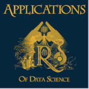

# DSApps @ TAU 2020: Assignment 0

### Welcome to Assignment 0!

1. Please open up a Github account. You *could* use this Github later in life for private projects, so:
	* do register with an email account you're comfortable with
	* do register with a "serious" user name, perhaps just your email handle which is easy to remember
	* do remember the password
2. Please fill up [this](https://docs.google.com/forms/d/e/1FAIpQLSeEnqho4eU-YtkGTFTBDhxwMetrNNRZhh7gALH8dajSZKUIkA/closedform) survey. It is not anonymized. It is meant mainly for me to be able to connect your Github account, email and Uni. ID.
3. Run [`hw0_r.Rmd`](hw0_r.Rmd) R Markdown document. You can do it:
	* On your local machine using local R and RStudio installation
	* On your local machine using Docker
	* On RStudio Cloud
	* On Binder (Power users only...)
	* See details [here]().
4. Run [`hw0_python.ipynb`](hw0_python.ipynb) Jupyter notebook. You can do it:
	* On your local machine using local Python and Jupyter installation
	* On your local machine using Docker
	* On Binder
	* See details [here]().
5. You're done. :nail_care:

###### Giora Simchoni