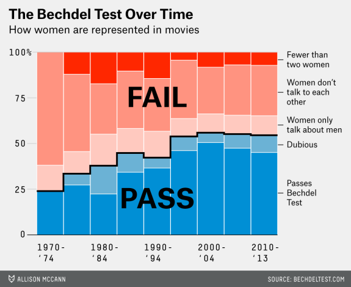

```{r child = "setup.Rmd"}
```

### Welcome

Welcome to Assignment 0 in R!

Good news: you don't have to do anything.

I just want you to run this R markdown at your leisure in RStudio, using RStudio cloud, Docker or your local installation, and see that everything is working. Though feel free to tweak things and show me interesting stuff if you find any.

### R Markdown

This is an [R Markdown](http://rmarkdown.rstudio.com) document. When you execute code within the notebook, the results appear beneath the code. 

Try executing this chunk by clicking the *Run* button within the chunk or by placing your cursor inside it and pressing *Ctrl+Shift+Enter*. 

```{r}
print(paste("One and one is", 1 + 1))
```

Add a new chunk by clicking the *Insert Chunk* button on the toolbar or by pressing *Ctrl+Alt+I*.

When you save the notebook, an HTML file containing the code and output will be saved alongside it (press *Ctrl+Shift+K* to knit it all and preview the HTML file).

### The Bechdel Test

From [bechdeltest.com](bechdeltest.com):

> The Bechdel Test, sometimes called the Mo Movie Measure or Bechdel Rule is a simple test which names the following three criteria: (1) it has to have at least two women in it, (2) who talk to each other, about (3) something besides a man. The test was popularized by Alison Bechdel's comic Dykes to Watch Out For, in a 1985 strip called [The Rule](http://alisonbechdel.blogspot.com/2005/08/rule.html).

In this notebook we'll try to reproduce some of the findings in [this](https://fivethirtyeight.com/features/the-dollar-and-cents-case-against-hollywoods-exclusion-of-women/) interesting piece on the [FiveThirtyEight](https://fivethirtyeight.com/) website (a must-visit site for data lovers), about the relation between the Bechdel Test score of Movies and their ROI.

### Packages

These are the packages you will need. If you don't have them, you need to uncomment the `install.packages()` line and install them first (you can also just copy this command to the R console and do it there if you don't want all the output printed in this notebook).

When you load the packages you may see different kinds of messages or warnings, skim them:

```{r}
# install.packages(c("tidyverse", "fivethirtyeight"))
library(tidyverse)
library(fivethirtyeight)
library(lubridate)
library(forcats)
```

### FiveThirtyEight's `bechdel` data

The data is already in the `bechdel` object from the `fivethirtyeight` package. Take a `glimpse()`:

```{r}
glimpse(bechdel)
```

Of interest to us:

- `year`: year of movie
- `title`: title of movie
- `clean_test`: the result of the Bechdel Test, which is an **ordered** factor, in which:
  - `nowomen` = Fewer than two named women characters
  - `notalk` = Women do not talk to each other
  - `men` = Women talk to each other about men only
  - `dubious` = Judges were not unanimous on whether movie passes Bechdel Test
  - `ok` = Passes Bechdel Test
- `budget_2013`, `domgross_2013`, `intgross_2013`: budget, domestic an international gross, adjusted to 2013

Interestingly not all Harry Potter movies pass the Bechdel Test:

```{r}
bechdel %>%
  filter(str_detect(title, "Harry Potter")) %>%
  select(year, title, clean_test, binary) %>%
  arrange(year)
```

This data is slightly outdated though, as you can see for example for "Harry Potter and the Deathly Hallows: Part 2" in [bechdeltest.com](https://bechdeltest.com/view/2539/harry_potter_and_the_deathly_hallows:_part_2/) that there *are* in fact few scenes in which women talk to each other about something other than men, like this one:


Though perhaps this specific example is not a particularly good one, as the two women are actually *fighting*, about the *daughter* of one of them... 🤦

### Movies Budget

Again, in what comes you don't have to *do* anything, just press the Run button, or Knit everything up, and see everything works, unless you want to change or add stuff.

For checking differences in budget, the 538 team filtered only movies after 1990, and considered "dubious" films to pass the Bechdel Test:

```{r}
bechdel_fil <- bechdel %>%
  filter(year >= 1990) %>%
  mutate(clean_test = fct_recode(clean_test, "ok" = "dubious"))
```

See budget distribution:

```{r}
bechdel_fil %>%
  ggplot(aes(budget_2013)) +
  geom_histogram(fill = "red", alpha = 0.5)
```

Which movies are the top budget films?

```{r}
bechdel_fil %>%
  arrange(-budget_2013) %>%
  head(5) %>%
  select(year, title, clean_test, budget_2013)
```

Recreate 538 median budget by Bechdel Test category:

```{r}
bechdel_fil %>%
  group_by(clean_test) %>%
  summarise(n = n(), median_budget_mill = round(median(budget_2013)/1000000, 1))
```

Apparently the budget of movies failing the Bechdel Test is considerably higher. Movies with named women characters who do not speak to one another, have the highest median budget, ~80% larger than movies which pass the Bechdel Test. But this makes you wonder which movies made the sample, who collected it and how?

### Movies Gross

The 538 team differentiated between "domestic" (a.k.a US and Canada) and "international-only" gross:

```{r}
bechdel_fil <- bechdel_fil %>%
  mutate(intonlygross_2013 = intgross_2013 - domgross_2013)
```

See gross distribution:

```{r}
bechdel_fil %>%
  pivot_longer(c("domgross_2013", "intonlygross_2013"), names_to = "gross_type", values_to = "gross") %>%
  ggplot(aes(gross, fill = gross_type)) +
  geom_histogram(alpha = 0.5)
```


Which movies are the top grossing films?

```{r}
bechdel_fil %>%
  arrange(-intgross_2013) %>%
  head(5) %>%
  select(year, title, clean_test, budget_2013, intgross_2013)
```

### Movies ROI

```{r}
bechdel_fil <- bechdel_fil %>%
  mutate(total_ROI = intgross_2013 / budget_2013,
         domestic_ROI = domgross_2013 / budget_2013,
         intonly_ROI = intonlygross_2013 / budget_2013)
```

See ROI distribution:

```{r}
bechdel_fil %>%
  pivot_longer(c("domestic_ROI", "intonly_ROI"), names_to = "ROI_type", values_to = "ROI") %>%
  ggplot(aes(ROI, fill = ROI_type)) +
  geom_histogram(alpha = 0.5)
```
Definitely some extreme ROI movies there:

```{r}
bechdel_fil %>%
  arrange(-total_ROI) %>%
  head(5) %>%
  select(year, title, clean_test, budget_2013, intgross_2013, total_ROI)
```


### Movies ROI vs. Bechdel Test Category

Recreate 538 team's median ROI numbers:

```{r}
bechdel_fil %>%
  group_by(clean_test) %>%
  summarise(n = n(),
            median_roi_domestic = round(median(domestic_ROI, na.rm = TRUE), 2),
            median_roi_int = round(median(intonly_ROI, na.rm = TRUE), 2))
```

As can be seen, passing the Bechdel Test does not seem to make a movie less profitable, if anything, when it comes to profits in US & Canada it makes it more profitable (but be very careful of attributing causality for what you're seeing here!).

See this in a boxplot:

```{r}
bechdel_fil %>%
  pivot_longer(c("domestic_ROI", "intonly_ROI"), names_to = "ROI_type", values_to = "ROI") %>%
  ggplot(aes(clean_test, log(ROI), color = ROI_type)) +
  geom_boxplot() +
  facet_wrap(~ ROI_type) +
  guides(color = FALSE)
```


However, one can hypothesize that the larger a movie's budget is, the larger its gross profit:

```{r}
bechdel_fil %>%
  ggplot(aes(log(budget_2013), log(intgross_2013))) +
  geom_point(color = "red", alpha = 0.5)
```

And so maybe lower budget movies have a higher potential for ROI?!

One way of exploring this is to model ROI or gross vs. Bechdel Test category, adjusting for budget:

```{r}
gross_lm <- lm(log(intgross_2013) ~ log(budget_2013) + binary, data = bechdel_fil)
summary(gross_lm)
```

```{r}
ROI_lm <- lm(log(total_ROI) ~ log(budget_2013) + binary, data = bechdel_fil)
summary(ROI_lm)
```

It seems having a larger budget is correlated with having a higher gross earnings and lower ROI. But passing the Bechdel Test does not significantly change any of these metrics.

This is used by the 538 team to claim that contrary to many Hollywood producers claims, producing a movie which represents women well does not decrease profit. While this may be so, again you have to wonder, if this sample of movies isn't random, is it biased in some way.

### Bechdel Test Over Time

Let's recreate this plot from the 538 piece:



Let's create the necessary data for the plot:

```{r}
extract_period <- function(year) {
  period <- year - year %% 5
  century <- year - year %% 100
  period_right <- period + 4 - century
  period_right <- ifelse(period_right < 10, str_c("0", period_right), period_right)
  str_c(period, "-\n'", period_right)
}

bechdel_by_time <- bechdel %>%
  mutate(period = extract_period(year)) %>%
  count(period, clean_test, binary)

bechdel_by_time
```

We see for each period, for each category of the Bechdel Test result, the number of movies.

A first attempt to recreate the plot:

```{r}
ggplot(bechdel_by_time, aes(x = period, y = n, fill = clean_test)) +
  geom_bar(position="fill", stat="identity", color = "#f0f0f0", width = 0.98, size=1) +
  labs(title = "The Bechdel Test Over Time",
       subtitle = "How women are represented in movies",
       caption = "SOURCE: BECHDELTEST.COM",
       y = NULL, x = NULL) +
  guides(fill = FALSE)
```

A second attempt:

```{r}
ggplot(bechdel_by_time, aes(x = period, fill = clean_test)) +
  geom_bar(aes(y = n), position="fill", stat="identity", color = "#f0f0f0",
           width = 0.98, size=1) +
  labs(title = "The Bechdel Test Over Time",
       subtitle = "How women are represented in movies",
       caption = "SOURCE: BECHDELTEST.COM",
       y = NULL, x = NULL) +
  guides(fill = FALSE) +
  scale_y_continuous(labels = c("0", "25", "50", "75", "100%"),
                     expand = c(0, 0),
                     sec.axis =
                       sec_axis(~ ., breaks = c(0.25, 0.5, 0.6, 0.8, 0.96),
                                labels = c("Passes\nBechdel\nTest", "Dubious",
                                           "Women only\ntalk about men",
                                           "Women don't\ntalk to each\nother",
                                           "Fewer than\ntwo women"))) +
  theme_classic() +
  scale_x_discrete(
    breaks = c("1970-\n'74", "1980-\n'84", "1990-\n'94", "2000-\n'04", "2010-\n'14"),
    expand = c(0, 0)) +
  scale_fill_manual(values=c("#ff2600", "#ff937f", "#ffcac0", "#6ab2d5", "#008fd5")) +
  theme(axis.ticks.x = element_blank(),
        plot.background = element_rect(fill = "#f0f0f0"),
        panel.grid = element_blank(),
        panel.border = element_blank(),
        axis.line.y = element_blank(),
        axis.ticks.length=unit(0.3, "cm")) +
  annotate("text", x = 5, y = 0.75, label= "bold(FAIL)", parse = TRUE, size = 12) +
  annotate("text", x = 5, y = 0.2, label= "bold(PASS)", parse = TRUE, size = 12)
```

For adding that black line separating between "PASS" and "FAIL" we need to really put an effort, not sure it's worth it:

```{r}
bechdel_summarized <- bechdel %>%
  mutate(period = extract_period(year),
         binary2 = case_when(
           clean_test %in% c("ok", "dubious") ~ "PASS",
           TRUE ~ "FAIL"
         )) %>%
  count(period, clean_test, binary2) %>%
  group_by(period, binary2) %>%
  summarise(nn = sum(n)) %>%
  group_by(period) %>%
  mutate(pct = nn/sum(nn)) %>%
  filter(binary2 == "PASS") %>%
  select(period, pct)

bechdel_by_time <- bechdel %>%
  mutate(period = extract_period(year)) %>%
  count(period, clean_test, binary) %>%
  inner_join(bechdel_summarized, by = "period")

# need to have an additional DF where the last percent is added with an additional period level
# for the geom_step to work
last_pct <- bechdel_by_time$pct[length(bechdel_by_time$pct)]
bechdel_add_step <- tibble(period = c(bechdel_by_time$period, "another_level"),
                           pct = c(bechdel_by_time$pct, last_pct))

ggplot(data = NULL) +
  geom_bar(data = bechdel_by_time, aes(x = period, y = n, fill = clean_test),
           position="fill", stat="identity", color = "#f0f0f0", width = 0.98, size=1) +
  geom_step(data = bechdel_add_step, aes(x = period, y = pct, group = 1),
            lwd = 2, position = position_nudge(-0.5)) +
  labs(title = "The Bechdel Test Over Time",
       subtitle = "How women are represented in movies",
       caption = "SOURCE: BECHDELTEST.COM",
       y = NULL, x = NULL) +
  guides(fill = FALSE) +
  scale_y_continuous(labels = c("0", "25", "50", "75", "100%"),
                     expand = c(0, 0),
                     sec.axis =
                       sec_axis(~ ., breaks = c(0.25, 0.5, 0.6, 0.8, 0.96),
                                labels = c("Passes\nBechdel\nTest", "Dubious",
                                           "Women only\ntalk about men",
                                           "Women don't\ntalk to each\nother",
                                           "Fewer than\ntwo women"))) +
  theme_classic() +
  scale_x_discrete(
    breaks = c("1970-\n'74", "1980-\n'84", "1990-\n'94", "2000-\n'04", "2010-\n'14"),
    expand = c(0, -1)) +
  scale_fill_manual(values=c("#ff2600", "#ff937f", "#ffcac0", "#6ab2d5", "#008fd5")) +
  theme(axis.ticks.x = element_blank(),
        plot.background = element_rect(fill = "#f0f0f0"),
        panel.grid = element_blank(),
        panel.border = element_blank(),
        axis.line.y = element_blank(),
        axis.ticks.length=unit(0.3, "cm"),
        plot.caption = element_text(size = 8, hjust = 1.2)) +
  annotate("text", x = 5, y = 0.75, label= "bold(FAIL)", parse = TRUE, size = 12) +
  annotate("text", x = 5, y = 0.2, label= "bold(PASS)", parse = TRUE, size = 12)
```

### Wrap up

And that's it, you have shown you can run a R Markdown document, seen some Tidyverse magic and hopefully learned something about the Bechdel Test. Good luck with the rest of the course!
